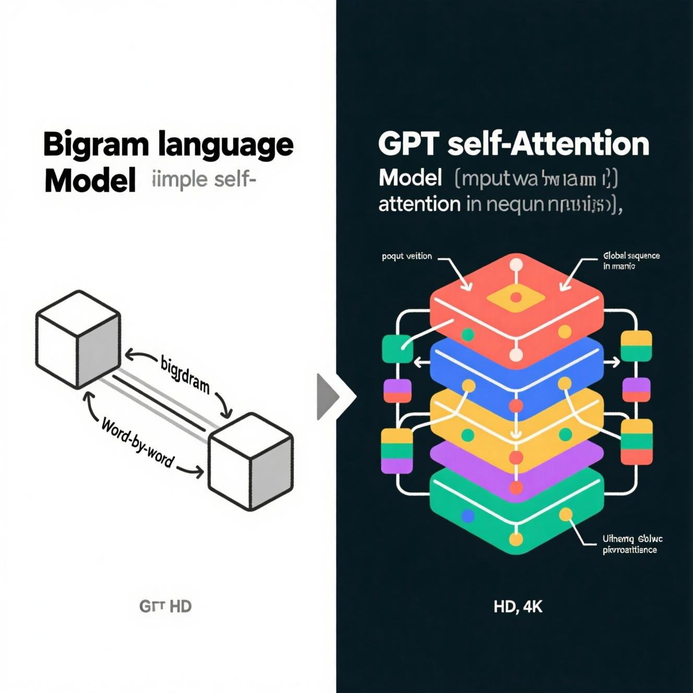

# GPT_from_scratch



Мини‑репозиторий с двумя реализациями языковых моделей на PyTorch:

- `bigram.py` — базовая bigram‑модель (учит распределение следующего символа из предыдущего).
- `v2.py` — упрощённая «мини‑GPT»: многоголовое внимание, позиционные эмбеддинги, блоки трансформера, генерация.
- `gpt_dev.ipynb` — рабочий ноутбук с экспериментами.
- `input.txt` — тренировочный корпус (например, Tiny Shakespeare).

## Установка

Рекомендуется создать изолированное окружение и установить зависимости из корня репозитория:

```
python3 -m venv .venv
source .venv/bin/activate
pip install -r ../requirements.txt
# PyTorch ставится по инструкции с pytorch.org под вашу платформу
```

## Данные

Положите тренировочный текст в `GPT_from_scratch/input.txt`. Для экспериментов подойдёт Tiny Shakespeare.

Обратите внимание: в `v2.py` путь к данным сейчас указан явно (абсолютный путь). Если запускаете на другой машине, замените его на относительный, например:

```python
from pathlib import Path
DATA_PATH = Path(__file__).parent / 'input.txt'
with open(DATA_PATH, 'r', encoding='utf-8') as f:
    text = f.read()
```

## Запуск

- Bigram‑модель:

```
python bigram.py
```

- Мини‑GPT (`v2.py`):

```
python v2.py
```

Обе программы печатают значения функции потерь во время обучения, а затем — сгенерированный текст.

## Производительность и устройства

- `v2.py` автоматически использует `mps` на Mac (если доступно), иначе CPU. Для NVIDIA CUDA при необходимости замените устройство на `cuda`.
- Для ускорения обучения используйте меньший `block_size` или `max_iters` на CPU.

## Структура кода (v2.py)

- `Head`, `MultiHeadAttention`, `FeedForward`, `Block` — минимальные компоненты трансформера.
- `BiGramNN` — модель с токен/позиционными эмбеддингами, стэком блоков и линейной головой LM.
- `generate` — авторегрессионная генерация символов по одному.