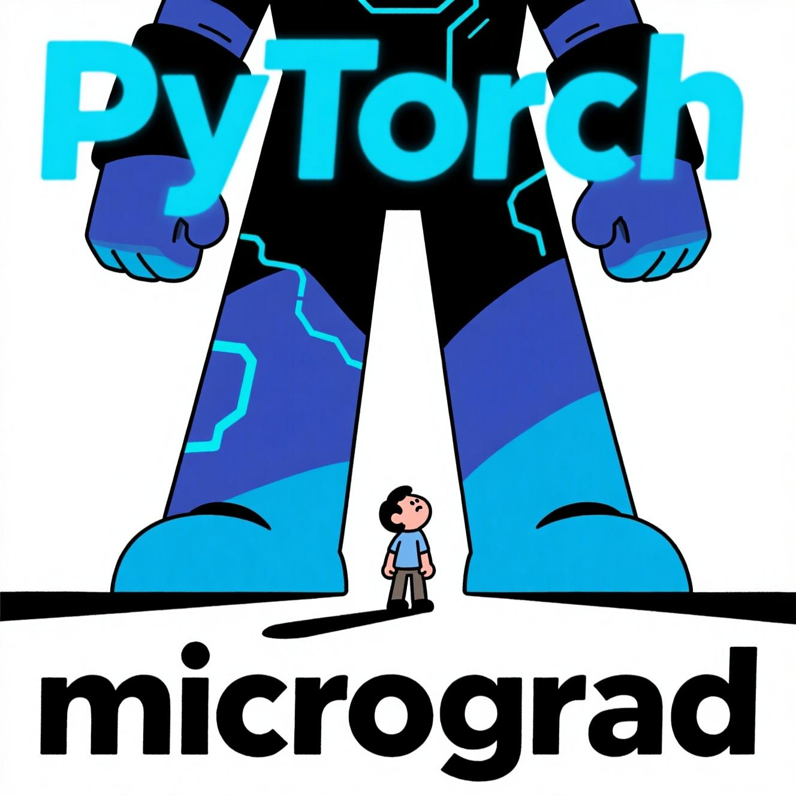

# Micrograd Implementation

Маленькая реализация алгоритма обратного распространения ошибки, а также нейронов, слоев и самой многослойно нейронной сети (перцептрона). 

Тут я тоже решил вставить картинку, которая давала бы понять, что вы работаете с чем-то маленьким.



## Содержимое
- `micrograd/engine.py` — класс `Value` с backpropagation (арифметика, tanh, exp, pow, деление, обратные операторы).
- `micrograd/nn.py` — модули `Module`, `Neuron`, `Layer`, `MLP`. У скрытых слоёв нелинейность `tanh`, последний слой — линейный.
- `demo.ipynb` — классификация точек (make_moons) на MLP.
- `test/` — базовые тесты корректности обратного прохода и MLP.

## Требования и запуск
Для запуска тестов и ноутбука установите dev-зависимости:

```
pip install -r requirements-dev.txt
```

Запуск тестов:
```
pytest -q
```

Демо-ноутбук:
- Откройте `demo.ipynb` в Jupyter/VS Code и выполните ячейки по порядку.

## Заметки по реализации
- В `Value` реализованы обратные операторы (`__radd__`, `__rsub__`, `__rtruediv__`, `__rmul__`), чтобы выражения вида `1 - Value`/`2 / Value` работали корректно.
- В `Neuron.__call__` нелинейность применяется только если `nonlin=True`. 
- В `MLP` последний слой создаётся с `nonlin=False`.
- В ноутбуке используется MSE loss.

## Дальнейшие улучшения (опционально)
- Расширить `engine.Value` новыми функциями (`relu`, `sigmoid`, `log`) и лоссами (логистический/hinge).
- Добавить больше тестов (на обратные операторы и поведение последнего линейного слоя).

### Лицензия

MIT